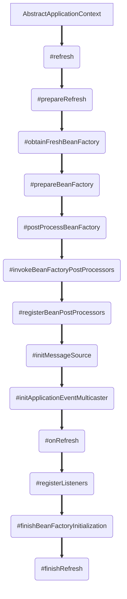
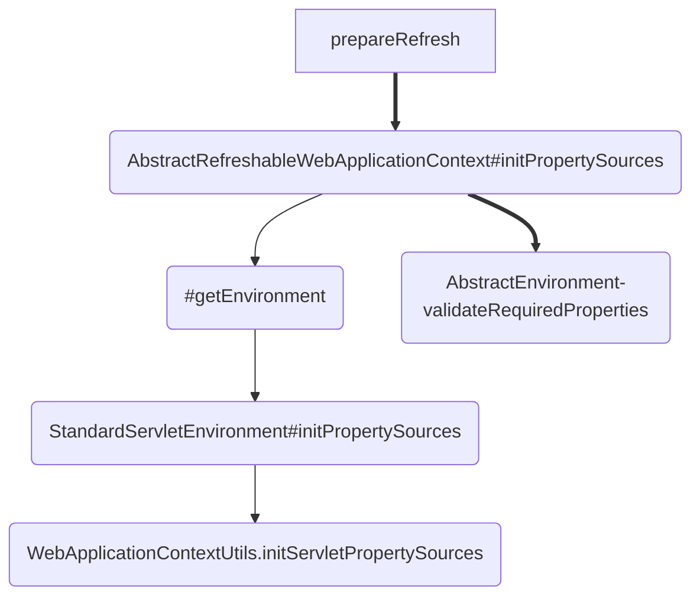
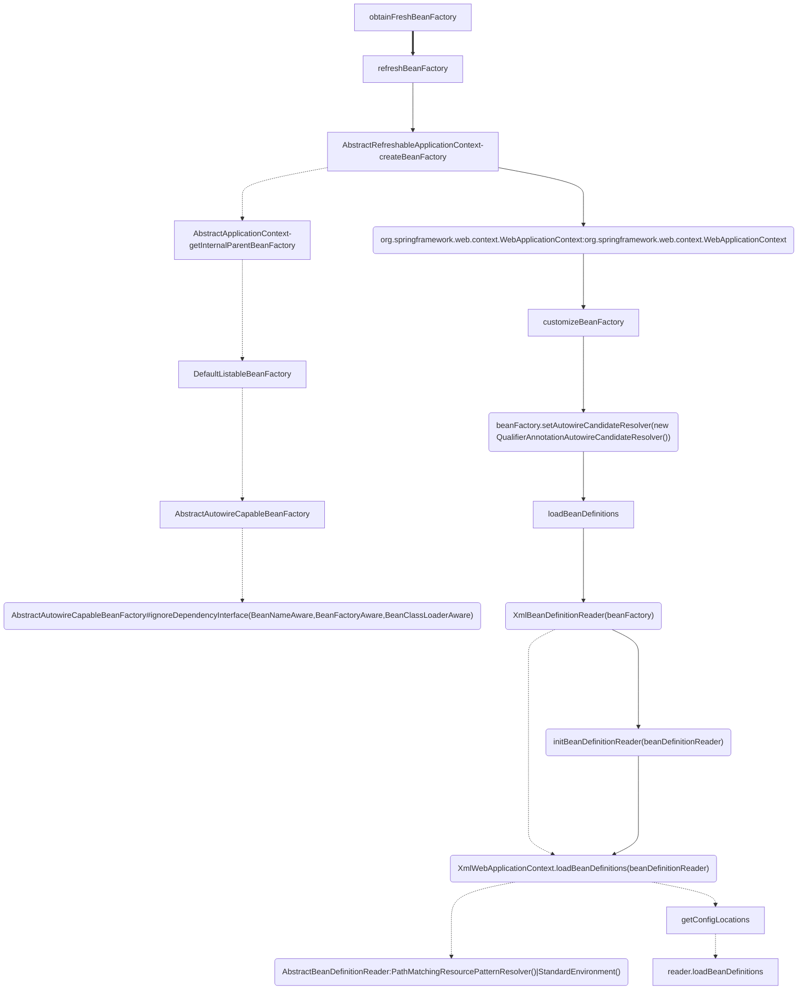
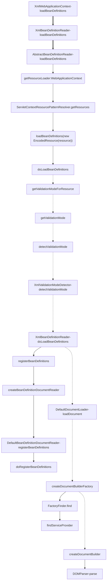

### spring labels

ConfigurableListableBeanFactory

ServletContext
WebApplicationContext

RequestScope
SessionScope
ServletContextScope


---
---

### url to handler

```
http://localhost:8080/CommonReg?cmd=REGISTER&langID=16&inviteType=1&

-->

\src\main\webapp\WEB-INF\web.xml

-->
    <servlet-mapping>
        <servlet-name>app</servlet-name>
        <url-pattern>/CommonReg/*</url-pattern>
    </servlet-mapping>

-->
	<servlet>
	   <servlet-name>app</servlet-name>
	     <servlet-class>org.springframework.web.servlet.DispatcherServlet</servlet-class>
		<init-param>
			<param-name>contextConfigLocation</param-name>
			<param-value>
				classpath:spring-vault-conf.xml
				/WEB-INF/app-servlet.xml
			</param-value>
		</init-param>
		<load-on-startup>1</load-on-startup>
	</servlet>

-->
org.springframework.web.servlet.DispatcherServlet


```


---


### spring load

**flow**
```
\webapp\WEB-INF\web.xml
	<listener>
		<listener-class>org.springframework.web.context.ContextLoaderListener</listener-class>
	</listener>


-->
org.springframework.web.context.ContextLoaderListener extends ContextLoader implements ServletContextListener

	public void contextInitialized(ServletContextEvent event) {
		this.contextLoader = createContextLoader();
		if (this.contextLoader == null) {
			this.contextLoader = this;
		}
		this.contextLoader.initWebApplicationContext(event.getServletContext());
	}

 -->

 org.springframework.web.context.ContextLoader

 public WebApplicationContext initWebApplicationContext(ServletContext servletContext) {
		if (servletContext.getAttribute(WebApplicationContext.ROOT_WEB_APPLICATION_CONTEXT_ATTRIBUTE) != null) {
			throw new IllegalStateException(
					"Cannot initialize context because there is already a root application context present - " +
					"check whether you have multiple ContextLoader* definitions in your web.xml!");
		}

		Log logger = LogFactory.getLog(ContextLoader.class);
		servletContext.log("Initializing Spring root WebApplicationContext");
		if (logger.isInfoEnabled()) {
			logger.info("Root WebApplicationContext: initialization started");
		}
		long startTime = System.currentTimeMillis();

		try {
			// Store context in local instance variable, to guarantee that
			// it is available on ServletContext shutdown.
			if (this.context == null) {
				this.context = createWebApplicationContext(servletContext);
			}
			if (this.context instanceof ConfigurableWebApplicationContext) {
				ConfigurableWebApplicationContext cwac = (ConfigurableWebApplicationContext) this.context;
				if (!cwac.isActive()) {
					// The context has not yet been refreshed -> provide services such as
					// setting the parent context, setting the application context id, etc
					if (cwac.getParent() == null) {
						// The context instance was injected without an explicit parent ->
						// determine parent for root web application context, if any.
						ApplicationContext parent = loadParentContext(servletContext);
						cwac.setParent(parent);
					}
					configureAndRefreshWebApplicationContext(cwac, servletContext);
				}
			}
			servletContext.setAttribute(WebApplicationContext.ROOT_WEB_APPLICATION_CONTEXT_ATTRIBUTE, this.context);

			ClassLoader ccl = Thread.currentThread().getContextClassLoader();
			if (ccl == ContextLoader.class.getClassLoader()) {
				currentContext = this.context;
			}
			else if (ccl != null) {
				currentContextPerThread.put(ccl, this.context);
			}

			if (logger.isDebugEnabled()) {
				logger.debug("Published root WebApplicationContext as ServletContext attribute with name [" +
						WebApplicationContext.ROOT_WEB_APPLICATION_CONTEXT_ATTRIBUTE + "]");
			}
			if (logger.isInfoEnabled()) {
				long elapsedTime = System.currentTimeMillis() - startTime;
				logger.info("Root WebApplicationContext: initialization completed in " + elapsedTime + " ms");
			}

			return this.context;
		}
		catch (RuntimeException ex) {
			logger.error("Context initialization failed", ex);
			servletContext.setAttribute(WebApplicationContext.ROOT_WEB_APPLICATION_CONTEXT_ATTRIBUTE, ex);
			throw ex;
		}
		catch (Error err) {
			logger.error("Context initialization failed", err);
			servletContext.setAttribute(WebApplicationContext.ROOT_WEB_APPLICATION_CONTEXT_ATTRIBUTE, err);
			throw err;
		}
	}   

-->

	protected ApplicationContext loadParentContext(ServletContext servletContext) {
		ApplicationContext parentContext = null;
		String locatorFactorySelector = servletContext.getInitParameter(LOCATOR_FACTORY_SELECTOR_PARAM);
		String parentContextKey = servletContext.getInitParameter(LOCATOR_FACTORY_KEY_PARAM);

		if (parentContextKey != null) {
			// locatorFactorySelector may be null, indicating the default "classpath*:beanRefContext.xml"
			BeanFactoryLocator locator = ContextSingletonBeanFactoryLocator.getInstance(locatorFactorySelector);
			Log logger = LogFactory.getLog(ContextLoader.class);
			if (logger.isDebugEnabled()) {
				logger.debug("Getting parent context definition: using parent context key of '" +
						parentContextKey + "' with BeanFactoryLocator");
			}
			this.parentContextRef = locator.useBeanFactory(parentContextKey);
			parentContext = (ApplicationContext) this.parentContextRef.getFactory();
		}

		return parentContext;
	}

    -->

	protected void configureAndRefreshWebApplicationContext(ConfigurableWebApplicationContext wac, ServletContext sc) {
		if (ObjectUtils.identityToString(wac).equals(wac.getId())) {
			// The application context id is still set to its original default value
			// -> assign a more useful id based on available information
			String idParam = sc.getInitParameter(CONTEXT_ID_PARAM);
			if (idParam != null) {
				wac.setId(idParam);
			}
			else {
				// Generate default id...
				if (sc.getMajorVersion() == 2 && sc.getMinorVersion() < 5) {
					// Servlet <= 2.4: resort to name specified in web.xml, if any.
					wac.setId(ConfigurableWebApplicationContext.APPLICATION_CONTEXT_ID_PREFIX +
							ObjectUtils.getDisplayString(sc.getServletContextName()));
				}
				else {
					wac.setId(ConfigurableWebApplicationContext.APPLICATION_CONTEXT_ID_PREFIX +
							ObjectUtils.getDisplayString(sc.getContextPath()));
				}
			}
		}

		wac.setServletContext(sc);
		String initParameter = sc.getInitParameter(CONFIG_LOCATION_PARAM);
		if (initParameter != null) {
			wac.setConfigLocation(initParameter);
		}
		customizeContext(sc, wac);
		wac.refresh();
	}

-->

	protected void customizeContext(ServletContext servletContext, ConfigurableWebApplicationContext applicationContext) {
		List<Class<ApplicationContextInitializer<ConfigurableApplicationContext>>> initializerClasses =
				determineContextInitializerClasses(servletContext);
		if (initializerClasses.size() == 0) {
			// no ApplicationContextInitializers have been declared -> nothing to do
			return;
		}

		Class<?> contextClass = applicationContext.getClass();
		ArrayList<ApplicationContextInitializer<ConfigurableApplicationContext>> initializerInstances =
				new ArrayList<ApplicationContextInitializer<ConfigurableApplicationContext>>();

		for (Class<ApplicationContextInitializer<ConfigurableApplicationContext>> initializerClass : initializerClasses) {
			Class<?> initializerContextClass =
					GenericTypeResolver.resolveTypeArgument(initializerClass, ApplicationContextInitializer.class);
			if (initializerContextClass != null) {
				Assert.isAssignable(initializerContextClass, contextClass, String.format(
						"Could not add context initializer [%s] as its generic parameter [%s] " +
						"is not assignable from the type of application context used by this " +
						"context loader [%s]: ", initializerClass.getName(), initializerContextClass.getName(),
						contextClass.getName()));
			}
			initializerInstances.add(BeanUtils.instantiateClass(initializerClass));
		}

		ConfigurableEnvironment env = applicationContext.getEnvironment();
		if (env instanceof ConfigurableWebEnvironment) {
			((ConfigurableWebEnvironment)env).initPropertySources(servletContext, null);
		}

		Collections.sort(initializerInstances, new AnnotationAwareOrderComparator());
		for (ApplicationContextInitializer<ConfigurableApplicationContext> initializer : initializerInstances) {
			initializer.initialize(applicationContext);
		}
	}


-->
\spring-context-3.2.4.RELEASE-sources.jar!\org\springframework\context\support\AbstractApplicationContext.java

	public void refresh() throws BeansException, IllegalStateException {
		synchronized (this.startupShutdownMonitor) {
			// Prepare this context for refreshing.
			prepareRefresh();

			// Tell the subclass to refresh the internal bean factory.
			ConfigurableListableBeanFactory beanFactory = obtainFreshBeanFactory();

			// Prepare the bean factory for use in this context.
			prepareBeanFactory(beanFactory);

			try {
				// Allows post-processing of the bean factory in context subclasses.
				postProcessBeanFactory(beanFactory);

				// Invoke factory processors registered as beans in the context.
				invokeBeanFactoryPostProcessors(beanFactory);

				// Register bean processors that intercept bean creation.
				registerBeanPostProcessors(beanFactory);

				// Initialize message source for this context.
				initMessageSource();

				// Initialize event multicaster for this context.
				initApplicationEventMulticaster();

				// Initialize other special beans in specific context subclasses.
				onRefresh();

				// Check for listener beans and register them.
				registerListeners();

				// Instantiate all remaining (non-lazy-init) singletons.
				finishBeanFactoryInitialization(beanFactory);

				// Last step: publish corresponding event.
				finishRefresh();
			}

			catch (BeansException ex) {
				// Destroy already created singletons to avoid dangling resources.
				destroyBeans();

				// Reset 'active' flag.
				cancelRefresh(ex);

				// Propagate exception to caller.
				throw ex;
			}
		}
	}


```


**AbstractApplicationContext#finishRefresh**


---




---



---

**XmlWebApplicationContext-loadBeanDefinitions**



